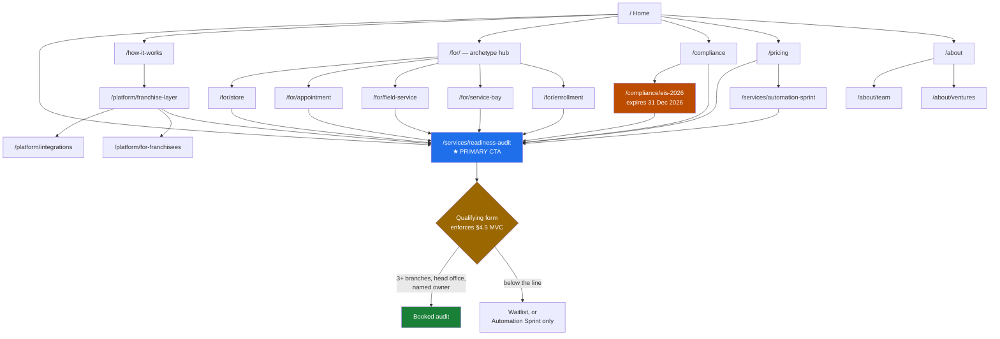

# Axon Enjin — Website Site Map & Information Architecture

**Version:** 1.0 · 3 August 2026 · **Status:** ready to build
**Owner:** Rhandie (assigned "Contents of Axon Enjin Website" in the 1 Aug 2026 alignment notes)
**Governed by:** [`AXON ENJIN Document.md`](AXON%20ENJIN%20Document.md) §2 (identity, voice, design), §4 (market, buying centre, MVC, do-not-touch), §5 (purchase paths), §11.1 (offer ladder)

> **Read §2.4 before writing a single line of copy.** Its compliance-claim rule is a **legal constraint, not a style preference** — the entire business model depends on the client being the filing party, and marketing that implies otherwise creates liability the company has deliberately structured away. §2.4 now also carries a second hard rule from BSP Memorandum M-2026-030: **never represent payment acceptance as an Axon Enjin capability**, because customer-facing representations are one of five factors the BSP weighs in a perimeter assessment. Copy is evidence.

---

## 1. The one decision that shapes everything

**The site's job is to sell a ₱95,000 paid diagnostic, not a platform.**

§11.1 is explicit: five rungs, each qualifying the client for the next, and *"never lead with the platform."* Rung 1 is the Franchise Systems Readiness Audit, deliberately paid because it filters tyre-kickers, gets you inside the operation before you quote, and produces something the client can act on even if they don't buy. §5 adds the reason: *"Nobody buys a platform from an unproven vendor."*

Almost every B2B SaaS site is built to sell the platform — pricing page, feature grid, free trial, "Get started". Building that here would fight the company's own go-to-market. So:

| Conventional SaaS site | This site |
| ----- | ----- |
| Hero → "Start free trial" | Hero → "Book a Readiness Audit" |
| Feature grid as the main event | Archetype pages: *how your kind of business actually runs* |
| Full pricing table, self-serve | Entry-offer prices published; platform rate card **not** published (§9) |
| Case studies as primary proof | Compliance and operating knowledge as proof — there are no case studies yet (§8) |
| Chatbot / demo request | Qualifying form that enforces the §4.5 minimum viable client **before** a call is booked |

**Secondary job, and it is nearly as important:** satisfy the gatekeeper. §4.3 names the finance head or external CPA as the role where *"deals die"*, and prescribes satisfying them early with the Compliance Pack. A site that speaks only to the owner will lose at the CPA. That is why §5 below gives the gatekeeper its own page rather than a paragraph.

---

## 2. Site map

```
/                                   Home — positioning, the audit, the ladder
│
├── /how-it-works                    The operating layer explained: centre ↔ edge
│   └── /how-it-works/rollout        What implementation actually involves
│
├── /for/                            ARCHETYPE HUB — five ways a network transacts
│   ├── /for/store                   A — counter transaction, inventory-driven
│   ├── /for/appointment             B — staff time and capacity
│   ├── /for/field-service           D — work travels to the customer
│   ├── /for/service-bay             E — job orders against assets
│   └── /for/enrollment              C — cohorts and terms
│
├── /platform/                       PRODUCT — only reachable, never the entry
│   ├── /platform/franchise-layer    Royalty, onboarding, benchmarking, LMS, field audit
│   ├── /platform/integrations       "Keep your existing POS. We connect to it."
│   └── /platform/for-franchisees    The users who can veto. Written *for them*.
│
├── /compliance                      THE GATEKEEPER PAGE — where deals die
│   └── /compliance/eis-2026         The 31 Dec 2026 e-invoicing deadline (dated, expires)
│
├── /services/                       THE LADDER
│   ├── /services/readiness-audit    ★ RUNG 1 — the primary conversion target
│   ├── /services/automation-sprint  Rung 2 — low-risk proof of competence
│   ├── /services/custom-build       Rung 4 — client-owned, compliance-offloaded
│   └── /services/engine-retainer    Rung 5 — capacity, not deliverables
│
├── /pricing                         Entry offers priced. Platform: "how pricing works".
│
├── /about/                          WHO WE ARE
│   ├── /about/team                  Four named people. The proof substitute.
│   └── /about/ventures              The studio's other arm, handled carefully
│
├── /insights/                       Archetype-specific operational content
│   └── /insights/<slug>             Credibility, not volume (§11.2)
│
├── /partners                        Franchise consultants, CPAs, POS vendors
├── /contact
│
└── legal/
    ├── /legal/privacy               Privacy policy (we are a PIP — §8.4)
    ├── /legal/terms
    └── /legal/data-processing       DPA roles, deployment options, sub-processors
```



---

## 3. Why archetypes, not verticals

§4.2 is emphatic: *"Do not think in verticals. Think in operating archetypes, defined by how the business transacts. Verticals inside an archetype share roughly 80% of their software."* §0 of Working Document 2 adds the sales consequence: *"You can say 'we've done this before' to a vertical you've never served, because you've served its archetype."*

With zero customers, that is not a convenience — it is the only honest way to claim relevant experience. Five archetype pages let a milk tea franchisor and a pharmacy chain both see themselves without the site making a vertical claim it cannot support.

**Vertical landing pages come later, and they sit under the archetype, not beside it.** Once there is a real F&B client, add `/for/store/qsr` and `/for/store/pharmacy`. Until then a vertical page is an empty promise and it cannibalises the archetype page's search authority.

| Archetype | Slug | How money is made | Lead verticals (§4.2, WD2 Tier 1–2) | Launch priority |
| ----- | ----- | ----- | ----- | ----- |
| **A — Store** | `/for/store` | Counter transaction, inventory-driven | QSR, café, milk tea, bakery, pharmacy, pet retail, agri-input | **Launch** — beachhead |
| **B — Appointment** | `/for/appointment` | Staff time and capacity | Salon, spa, derma, dental, optical, vet, fitness | **Launch** — parallel design partner |
| **D — Field / Dispatch** | `/for/field-service` | Work travels to the customer | Pest control, aircon cleaning, cleaning, home services | Phase 2 |
| **E — Service Bay** | `/for/service-bay` | Job orders against assets | Auto service, lube, tyre, printing, device repair | Phase 2 |
| **C — Enrollment** | `/for/enrollment` | Cohorts and terms | Tutorial, review, training centres, driving schools | Phase 3 — §12 builds Pack C last |

Launch with **A and B only**. §12 sequences Pack A at 3–6 months and Pack B at 6–9; publishing five archetype pages when two packs exist is the "large empty site" failure in §8.

---

## 4. Page-by-page specification

| Slug | Title | Primary job | Buying-centre role (§4.3) | Primary CTA | Priority |
| ----- | ----- | ----- | ----- | ----- | ----- |
| `/` | Axon Enjin — the franchise operating layer | Position in one screen; route to archetype or audit | Economic buyer | Book a Readiness Audit | **Launch** |
| `/services/readiness-audit` | Franchise Systems Readiness Audit | **Convert.** The page the whole site feeds | Economic buyer + champion | Qualifying form | **Launch** |
| `/how-it-works` | Centre to every branch | Explain the product without a demo | Economic buyer, operational buyer | See your archetype | **Launch** |
| `/for/store` | Software for multi-branch store networks | Recognition: "this is my business" | Economic buyer, operational buyer | Book an audit | **Launch** |
| `/for/appointment` | Software for multi-branch appointment networks | Same, archetype B | Economic buyer, operational buyer | Book an audit | **Launch** |
| `/compliance` | Compliance, stated plainly | **Satisfy the gatekeeper before they object** | Gatekeeper (finance head / external CPA) | Download the Compliance Pack outline | **Launch** |
| `/pricing` | How pricing works | Price the entry offers; frame the platform | Economic buyer, gatekeeper | Book an audit | **Launch** |
| `/about/team` | The people who build it | Proof substitute where case studies would be | All — especially operational buyer | Book an audit | **Launch** |
| `/contact` | Contact | Catch non-audit intent | — | — | **Launch** |
| `/legal/privacy` | Privacy policy | DPA obligation; we are a PIP (§8.4) | Gatekeeper | — | **Launch** |
| `/compliance/eis-2026` | The 31 December 2026 e-invoicing deadline | Timely wedge — **expires** | Gatekeeper, economic buyer | Book an audit | **Launch, dated** |
| `/services/automation-sprint` | Automation Sprint | Rung 2; the door for sceptics | Economic buyer, champion | Scope a sprint | Phase 2 |
| `/platform/franchise-layer` | The franchise operating layer | Product depth for the convinced | Operational buyer, champion | Book an audit | Phase 2 |
| `/platform/integrations` | Keep your existing POS | Remove the rip-and-replace objection | Operational buyer, influencer | Book an audit | Phase 2 |
| `/platform/for-franchisees` | For franchisees | Pre-empt the veto that surfaces at renewal | **Users + hidden blocker** | — (reassure, don't convert) | Phase 2 |
| `/how-it-works/rollout` | What a rollout actually involves | Answer informed scepticism honestly | Operational buyer | Book an audit | Phase 2 |
| `/services/custom-build` | Custom build | Rung 4; the own-the-asset buyer | Economic buyer, gatekeeper | Talk to us | Phase 2 |
| `/services/engine-retainer` | Engine retainer | Rung 5; also the spinout vehicle | Economic buyer | Talk to us | Phase 3 |
| `/for/field-service`, `/for/service-bay` | Archetypes D, E | Expand reach as packs ship | Economic buyer | Book an audit | Phase 2 |
| `/for/enrollment` | Archetype C | Last pack in §12 | Economic buyer | Book an audit | Phase 3 |
| `/partners` | For franchise consultants and CPAs | **Convert the influencer before they oppose** | Influencer | Become a referral partner | Phase 2 |
| `/about/ventures` | The ventures arm | Explain the second arm without alarming clients | Economic buyer | — | Phase 2 |
| `/insights/*` | Operational content | Credibility, not volume (§11.2) | Champion, operational buyer | Book an audit | Phase 2 onward |
| `/legal/terms`, `/legal/data-processing` | Terms, data processing | Contractual and DPA posture | Gatekeeper | — | Phase 2 |

**On `/platform/for-franchisees`.** §4.3 says users *"cannot approve"* but *"can veto by not adopting — which surfaces at renewal, not signature"*, and §13 makes franchisee non-adoption a High risk with a measurable trigger (branch usage below 60% at month 6). §4.4 goes further: franchisees are the **hidden blocker**, because the royalty engine increases visibility into their sales. A page written *for franchisees*, about what they get — less admin, clearer targets, easier commissary ordering — is cheap insurance on renewal, and it gives the franchisor something to forward to their network. Do not try to convert on it.

---

## 5. Content briefs — launch pages

### `/` — Home

1. **Hero.** The §2.2 positioning, compressed. *"You cannot see what happens outside head office. Axon Enjin is the franchise operating layer — the system that carries signal between the centre and every branch."* CTA: **Book a Readiness Audit — ₱95,000, two weeks, credited against what you buy next.** Price in the hero: it disqualifies tyre-kickers on the first screen, which is the audit's stated purpose.
2. **The three problems, named as operators name them.** Standardisation across locations · visibility for the franchisor · simplicity for the franchisee (§4.1). Use §2.4's voice: *"See every branch's numbers by 9am"*, not *"data-driven insights"*.
3. **Why not an ERP, why not a POS.** §2.2's two contrasts verbatim in substance: generic ERPs treat every location as a separate company; POS vendors stop at the counter. This is the sharpest paragraph on the site — it is the whole category argument.
4. **Pick your archetype.** Five cards, two live at launch. Not twenty vertical logos.
5. **Compliance, in one line with a link.** *"Built to the functional requirements of the applicable BIR issuances. You hold the registration."* Never more than that on the home page.
6. **The ladder, honestly.** Audit → Sprint → platform. Say that nobody should buy a platform from a vendor they have not tested. It is disarming and it is the company's own position.
7. **Who we are.** Four named people, PUP, competition record — stated plainly, once, without the startup register §2.3 rules out.

**Voice traps:** no "revolutionary", no "empower", no "seamless", no countdown, no "limited slots". §2.3: these buyers *"have survived things"* and do not respond to urgency theatre.

### `/services/readiness-audit` — the conversion page

1. **What it is.** Two weeks, ₱95,000 + VAT, fully creditable against paths 1–4 and 6.
2. **What you get** — the deliverable, itemised (WD2 §6): process map, systems inventory, compliance gap list, prioritised roadmap. Plus the two additions in §11.1: **a dated, cited EIS coverage determination** against RR 11-2025 §3(A), and a pointer to the additional deduction available for setting up an electronic sales reporting system.
   > ⚠️ **State that the deduction exists; never quantify it.** Quantifying a client's tax deduction is tax advice and breaches both §2.4 and §8.5 clause 1. "Your accountant will want to look at this" is the correct register.
3. **Why it is paid.** Free proposals produce free-proposal-quality thinking. Say it plainly.
4. **What it is not.** Not a sales call. Not a demo. You get the document whether or not you buy.
5. **Who it is for** — the §4.5 line, published: 3+ branches, a head office with someone accountable for operations, a named internal project owner. Publishing the floor is a filter, not a deterrent.
6. **The qualifying form** (§6 below).

### `/compliance` — the gatekeeper page

This page exists because §4.3 says the gatekeeper is *"where deals die"*, and because a CPA arriving at a vendor site and finding nothing about BIR registration assumes the worst.

1. **The doctrine, stated as the client's advantage.** §8.1's three sentences, in plain language: the software is compliant by design; **you** file; money never moves through our system, only past it.
2. **What we build regardless of who files** — the §8.2 list. Sequential non-resettable numbering, non-resettable grand total, retained X/Z-readings, senior citizen and PWD discounts, audit trail and Standard Audit File export, EIS transmission capability where you are covered, local storage and backup with authorised BIR access.
3. **What we warrant and what we do not** — §8.5 clause 1, near-verbatim. *"We warrant the software implements the functional requirements of the applicable BIR issuances as at the effective date. We do not warrant that you will obtain accreditation or registration — that depends on your filings, your tax standing, and RDO discretion."* A CPA reading that trusts the vendor more, not less.
4. **Who registers what** — a simplified §8.3 table. Include the RMO 9-2021 point: **each franchisee registers the system at its own RDO and receives its own Acknowledgement Certificate**, even on shared servers with identical software. Most franchisors do not know this, and knowing it is a credibility event.
5. **Data protection** — §8.4's deployment table, client-facing. Health data, minors' data and biometrics go single-tenant in the client's own cloud tenancy.
6. **The Compliance Pack**, as the deliverable it is: system description, process flow, sample invoices, backup and DR plan, sworn-statement annex data, X/Z-reading samples.

**Voice traps, and these are the legal ones:** never "fully BIR compliant". Never "BIR accredited". Never imply that buying the software produces a registration outcome. Never name a sector regulator in a way that implies we certify anything (WD2's closing note: regulator names per vertical are indicative and must be verified before appearing in marketing material).

### `/compliance/eis-2026` — the dated wedge

The mandate under RR 11-2025, as extended to **31 December 2026** by RR 26-2025. Roughly five months out at launch.

- Who is covered, accurately: e-commerce or internet transactions (a very wide definition that expressly includes sale through digital platforms and food delivery) · Large Taxpayers Service taxpayers · Large Taxpayers under the ₱1B gross-sales test · users of a CAS, CBA-with-e-invoicing, or **other invoicing software**.
- Who is **not yet** covered: POS System users, exporters and RBEs sit in a second track that is conditional on the BIR establishing a capable system *and* on a separate regulation that has not issued.
- The qualifying question, stated so the reader can self-assess: *do you sell or take payment online in any form — delivery apps, your own site, an online store, online bookings with deposits?*
- **Having a POS is not compliance.** Paper invoices without transmission capability do not qualify as electronic invoices.

> ⚠️ **Two constraints on this page.** First, the second-track reading is contested — see [`RESEARCH-QUEUE.md`](RESEARCH-QUEUE.md) R-11. Do not tell a POS-only prospect they are obligated until that is settled. Second, this page **expires**. Put a review date in the CMS and a visible "current as at" stamp. A stale deadline page is worse than no page.

### `/about/team` — the proof substitute

With no case studies, this page carries the credibility load. Four named people with real roles (§ alignment notes): business/operations/finance/legal; tech and operations; business and tech; tech and operations. State the competition record and the PUP affiliation **once**, factually.

**The trap is register, not content.** §2.3: we are operators, not "startup-cute". The same facts can read as *"award-winning student builders"* or as *"four engineers who have shipped under deadline pressure repeatedly"*. The second one is what a franchisor with twenty years of operating history responds to.

---

## 6. Conversion architecture

Every path ends at a booked audit, and the form does the qualifying so the founder does not spend calls doing it.

```
Home / archetype / compliance / insights / EIS page
        ↓
/services/readiness-audit
        ↓
Qualifying form  ──────────────────────────────────────────────┐
        ↓                                                       │
   Meets §4.5?                                                  │
        ├── YES → calendar link → audit scoping call            │
        └── NO  → waitlist for the future self-serve product,   │
                  or Automation Sprint only (§4.5, §5)  ────────┘
```

**Form fields, in this order.** The first three are the §4.5 minimum viable client and the qualifier should be automatic on them.

| # | Field | Enforces | Disqualifies on |
| ----- | ----- | ----- | ----- |
| 1 | How many branches? | §4.5 floor | Under 3 → waitlist or Sprint |
| 2 | Typical monthly sales **per branch** | §4.5 revenue floor | See the caveat below |
| 3 | Who would run this day to day, by name? And do they have the time? | §13 row 1 — **the highest-severity risk in the register** | No name, or "the owner" → flag, do not auto-reject |
| 4 | How many branches are franchisee-owned, and are those franchisees separate taxpayers? | Compliance Pack and implementation scope (FLAGS F-28) | Never — this prices the work |
| 5 | Do you sell or take payment online in any form? | EIS coverage (R-05) | Never — this sets the wedge |
| 6 | What are you using now, and what are you doing in spreadsheets? | Pain and current spend | Never |
| 7 | Who else has to agree to this? | Buying committee mapping (§4.3) | Never |

> ⚠️ **Field 2 must not ship until FLAGS.md F-02 is resolved.** §4.5 states the revenue floor as "₱1.5M+ per month **network** revenue" while §7.2 uses the same ₱1.5M as **per-branch** revenue — an 8× difference that decides who is a prospect. Ask the question per branch (which is the reading the pricing argument needs), but **do not wire an automatic rejection to it** until the threshold is settled.

**Question 3 is the most valuable field on the site.** §13's highest-severity risk is that target clients have no head office capable of adopting software, and §16 calls it testable for free. Asking it in the form tests it at zero marginal cost on every inbound lead, and the answers accumulate into exactly the evidence WD4 §2.1 is trying to gather through interviews. Instrument it as a structured field, not free text.

**Do not auto-reject on question 3.** §13's mitigation is to *sell the operator with the software* — a managed-operations component or heavier enablement. A prospect who cannot name an owner is a different offer, not a lost lead.

---

## 7. Navigation, URLs, and the archetype/vertical relationship

**Primary nav (5 items, no dropdown on mobile):** How it works · Who it's for · Compliance · Pricing · Book an audit *(button)*

Keep `/platform/*` **out of the primary nav.** It is reachable from `/how-it-works` and from archetype pages, but promoting it to the nav re-centres the site on the platform and undoes §1. Product depth serves people who are already convinced; it should not be the first thing a stranger sees.

**Footer:** archetypes · services · insights · partners · about · team · ventures · legal · contact.

**URL rules.**
- `/for/<archetype>` for archetypes. Later, `/for/store/<vertical>` for verticals — nested, so the archetype page holds the authority and the vertical page inherits it. Never `/for/qsr` at the top level competing with `/for/store`.
- No dates in URLs except the EIS page, where the year is the point.
- One canonical URL per concept. If a vertical page and an archetype page would say 80% of the same thing — which §4.2 says they will — write the archetype page and add a vertical section to it, rather than two thin pages.

---

## 8. Minimum viable launch — and the absent-proof problem

**Launch with eleven pages.** Home · readiness-audit · how-it-works · for/store · for/appointment · compliance · compliance/eis-2026 · pricing · about/team · contact · legal/privacy.

That is the smallest set that positions the company, serves the gatekeeper, and converts. Everything else waits for a reason to exist.

**The honest problem: there are no customers.** §16 opens with it — *"No customers. Every number in §6 and §7 is benchmarked against comparable vendors, not tested against a buyer."* A site with a "Customers" nav item and one placeholder, or worse a fabricated testimonial, destroys the exact commodity the company is selling. §2.3 sells plainspokenness; faking traction contradicts the brand at the root.

**Four legitimate proof substitutes, in descending strength:**

1. **Regulatory specificity.** Almost no competitor site names the issuance. Publishing the §8.2 build list, the §8.5 warranty language, and the RMO 9-2021 per-franchisee registration rule demonstrates domain command that cannot be faked and that a CPA can verify. This is the strongest asset the company has today, and it is free.
2. **Operating specificity.** §2.3: *"We talk about branch-level specifics — the 9am numbers, the commissary order, the franchisee who hasn't submitted."* A page that describes a commissary transfer correctly proves more than a logo wall.
3. **Named people with a verifiable record.** Real names, real competition results, real certifications. Stated once, factually.
4. **The audit itself as the proof mechanism.** *"You do not have to trust us. Buy two weeks and judge the document."* This is what the paid diagnostic is **for** — it converts absent proof from an objection into the offer.

**What to do instead of a case-studies page:** an `/insights` piece that works a realistic scenario end to end — a twelve-branch milk tea network, the royalty reconciliation, the commissary variance — labelled unambiguously as an **illustrative worked example, not a client engagement**. It shows the thinking without claiming the logo. Revisit the moment the first design partner signs and consents.

**Add a customers page when there is a customer.** Not before.

---

## 9. Pricing display — recommendation and defence

**Publish the entry offers. Do not publish the platform rate card yet.**

| What | Display | Why |
| ----- | ----- | ----- |
| Readiness Audit | **₱95,000** + VAT, in the hero | It is the CTA and the filter. A price on the first screen is the cheapest disqualification mechanism on the site |
| Automation Sprint | **₱145,000** + VAT, fixed scope, 3 weeks | Fixed-price and fixed-scope is the selling point; hiding it wastes it |
| Compliance Pack | **₱30,000** + VAT | Small, concrete, builds gatekeeper trust |
| Custom build | **"From ₱464,000"** | §14 locks the floor with no exceptions; publishing it enforces it against your own future self |
| Engine retainer | **"From ₱180,000/month"** | Same |
| **Platform subscription** | **"How pricing works"** — per-branch, annual prepay with 2 months free, priced by archetype pack and modules, quoted after the audit. **No numbers.** | Three reasons below |

**Why the platform rate card stays off the site.**

1. **It is not internally consistent yet.** [`FLAGS.md`](FLAGS.md) F-01 (the FX reference tripped its own review condition) and F-03 (four defects in the packaged-plans table, including three incompatible prices for a 20-branch network) both remain open. Publishing an unstable rate card creates an anchor you then have to walk back, and §14's own note is that repricing carries no incumbency cost *only* before the first quote.
2. **The ladder forbids it.** §11.1 says never lead with the platform, and the audit is what makes a platform quote credible. A published per-branch price invites a prospect to self-serve their way to a "too expensive" conclusion without the diagnostic that justifies it.
3. **Naked per-branch numbers invite the wrong comparison.** Core at $150/branch is at rough parity with StoreHub Pro at $149 (FLAGS F-09) — a prospect comparing line items concludes "same price as a POS", which is precisely the framing §2.2 exists to defeat. The differentiator is the franchise layer, and that has to be understood before the number lands.

**What the `/pricing` page says instead:** how pricing works and why. Per branch, because a network is what we serve. Annual prepay, two months free. Priced by archetype pack plus the franchise modules you actually use. Implementation quoted separately and honestly, because it varies with how many of your branches are separately registered taxpayers. Then: *"We quote after the audit, because quoting before it would be guessing."* That sentence sells the audit better than a table would.

**Revisit once F-01 and F-03 are closed.** A published rate card is a strong trust signal in a market of "contact us for pricing" vendors — it is a *when*, not an *if*.

---

## 10. Design notes

From §2.6, which is unusually specific and should be handed to whoever does the identity work:

- **Legibility over aesthetics.** The product is used by branch staff on **cheap Android tablets, in bad lighting, at speed, sometimes one-handed.** High contrast, large touch targets, no thin type, no low-contrast grey-on-grey. §2.6 warns that most B2B SaaS design fails this test *"and it will cost you adoption at branch level — which is where renewals are decided."*
- **Dense data, calm surface.** Franchisors look at tables. Design tables that do not exhaust the reader.
- **The signal / conduction motif is available** — paths, nodes, centre-to-edge. **Resist literal neuron illustrations**; §2.6 says it reads as a biotech company.
- **Two audiences, one system.** Head office is analytical, desktop, dense. Branch is fast, mobile, minimal. Do not force one aesthetic across both — and note that the marketing site is a *third* context and should not inherit either wholesale.

> ⚠️ **The superseded MSME campaign plan's style guide is wrong for this.** It specifies *"dark elegant visuals, cinematic lighting, startup aesthetic"*. That is the opposite brief for a product used on a cheap tablet in a stockroom, and §2.6 supersedes it. See [`FLAGS.md`](FLAGS.md) F-12.

**Taglines** (§2.7, descending preference — *"pick one and stop"*): *Signal from every branch* · *The operating layer for networks* · *Built for networks, not locations* · *Head office to every branch*.

---

## 11. Technical and SEO notes

**Market reality.** PH-only (§1), a committee sale (§4.3), and a total addressable set measured in hundreds of qualifying networks rather than millions of users. This is a **low-volume, high-intent** search problem. Optimising for traffic is the wrong objective; optimising for the four hundred people who could actually sign is the right one.

- **Target the operator's language, not the category's.** People search *"royalty computation franchise Philippines"*, *"consolidate sales reports multiple branches"*, *"commissary inventory system Philippines"*, *"BIR CAS registration franchise"* — not *"franchise operating layer"*, which is a category the company is inventing (§2.2) and which nobody searches yet.
- **The compliance pages are the SEO asset.** *"RMO 9-2021 franchisee registration"*, *"EIS deadline December 2026"*, *"Acknowledgement Certificate vs Permit to Use"* are low-competition, high-intent queries where genuine primary-source accuracy wins — and where the research already exists in [`research/verified/01-regulatory-tax-fx-baseline.md`](research/verified/01-regulatory-tax-fx-baseline.md).
- Local schema, PH English, `.ph` domain worth acquiring alongside `.com`.
- No cookie banner unless analytics genuinely requires one; if it does, default to declining non-essential.

**Instrument from day one** — this is the analytics equivalent of §7.4's "baseline unknown, instrument the first three":

| Event | Why it matters |
| ----- | ----- |
| `archetype_page_view` by archetype | Which archetype has real demand — this is a §12 build-order input |
| `qualifying_form_start` / `_complete` / `_abandon_at_field` | Where the MVC filter loses people, and whether the floor is set right |
| `mvc_qualified` vs `mvc_below_line` | The addressable-set reality check. If almost everyone is below the line, §13 row 1 or §4.5 is wrong |
| `field_3_answer` (named owner: yes / owner-is-founder / no) | **Direct measurement of the highest-severity risk in the register**, on every lead, free |
| `field_5_answer` (sells online: yes/no) | EIS wedge applicability across the real funnel |
| `compliance_page_view` before vs after form start | Whether the gatekeeper page is doing its job |
| `audit_booked` | The only conversion that counts |

---

## 12. What the site must not contain

| Never | Source |
| ----- | ----- |
| "Fully BIR compliant", "BIR accredited", or any implication that buying the software produces a registration outcome | §2.4 — a **legal** constraint, not stylistic. §8.5 clause 1 |
| Any representation that Axon Enjin accepts payments, or that payments are "built in" | §2.4, per BSP M-2026-030 — customer-facing representations are a perimeter factor. §13 rates this catastrophic |
| A quantified estimate of a client's tax deduction or tax saving | §11.1, §2.4, §8.5 clause 1 — that is tax advice |
| Certification of any sector licence (FDA, DOH, TESDA, LTO, PDEA, DOT, PNP-SOSIA) | §8.3 — *"Store and remind. Never certify."* WD2: regulator names are indicative and must be verified before appearing in marketing |
| Payments, wallets, remittance, lending, BNPL, insurance quoting, crypto, gaming, or recruitment as capabilities | §4.6 do-not-touch list — each would make Axon Enjin the regulated party |
| Countdowns, "limited slots", "final hours", or any urgency device | §2.3 — buyers *"do not respond to urgency theatre"*. §2.4 |
| Fabricated or placeholder testimonials, logos, or case studies | §16 — there are no customers. See §8 above |
| Uncited market statistics — brand counts, outlet counts, sector revenue, GDP share | **[`FLAGS.md`](FLAGS.md) F-08:** §4.1 is the only TAM statement in the corpus, it carries no citation, and its outlet figure is stale by roughly 40%. See §13 below |
| Per-branch platform prices | §9 above — F-01 and F-03 open |
| Hackathon-led credibility framing, "startup mindset", founder-hustle register | §2.3 — we are **not** "startup-cute". FLAGS F-12 |
| A venture presented as "Axon [something]" | §2.5 — ventures get their own names; an *"An Axon Enjin venture"* endorsement line is the correct device |

**On `/about/ventures`.** §2.5's reasoning is that investors discount things that look like a side project of a services firm — but the mirror risk is a *client* wondering whether their fees fund someone else's startup. Frame the ventures arm as the reason the tooling is good: §3.1 says client work generates the pattern recognition and ventures give the studio proprietary tooling that makes delivery faster than a pure agency's. §2.2's third paragraph is already the right copy: *"unlike an agency, we own products and build ventures — so the tooling improves whether or not you are paying us this month."*

---

## 13. Blockers before publication

| # | Blocker | Affects | Status |
| ----- | ----- | ----- | ----- |
| 1 | **F-02 — the ₱1.5M unit ambiguity** | Qualifying form field 2. Cannot wire an auto-reject to a threshold that is ambiguous by 8× | **Open** — needs a founder decision or five discovery calls |
| 2 | **F-08 — every market statistic is uncited and the outlet count is stale** | Any page carrying a market claim: home, archetypes, insights | **Open** — was scoped to the halted sub-agent 2. Until then, **publish no market statistics at all.** The site does not need them; positioning does the work |
| 3 | **F-01 / F-03 — the rate card is not internally consistent** | `/pricing`. Handled by publishing only entry offers (§9) | **Mitigated, not resolved** |
| 4 | **R-11 — the EIS second-track reading is contested** | `/compliance/eis-2026`. Do not tell POS-only prospects they are obligated | **Open** — narrow question, now §8.7 second wave item 2 |
| 5 | Sector regulator names per vertical are indicative and unverified | Future vertical pages | **Open** — WD2's own closing caveat |
| 6 | Privacy policy content requires the §8.4 / §8.5 clause-3 position | `/legal/privacy`, `/legal/data-processing` | **Blocked on Pillar 9**, which the halted sub-agent 5 would have produced |

**None of these blocks the launch of the eleven-page set**, provided the site carries no market statistics and no per-branch prices. Both omissions are, on the evidence, improvements.

---

*Information architecture and content specification. Compliance and regulatory language on this site is governed by Company Document §2.4, §8.2, §8.3 and §8.5 — copy touching any of it should be reviewed against those sections before publication, and the three written legal opinions in §8.7 are not yet in hand.*
