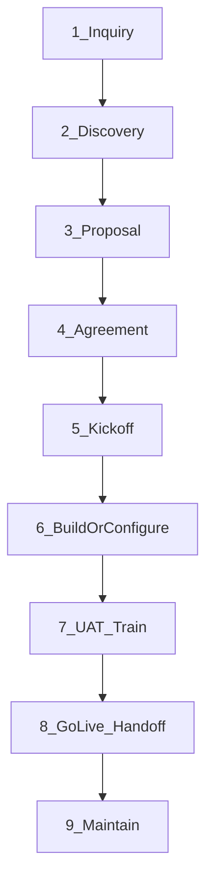

# Axon Enjin — Commercial Model v2

**Status:** Canonical for go-to-market, website, public offers, **and quotation packaging** (8 August 2026; F-03 closed 11 August 2026)  
**Team:** Carlos Jerico Dela Torre (CEO) · Aidan Tiu (CTO) · Gerald Berongoy (Deputy Engineer) · Rhandie Sales Jr. (Deputy Engineer)

> **Precedence.** For what we sell publicly, how we deliver, how the site talks, **and how we package quotations**, **this file wins** over the Company Document’s old offer ladder (5-rung audit path), archetype pack hub, and Starter / Growth / Enterprise rate card (**retired — D-2026-005 / F-03**). The Company Document still governs identity roots, regulatory doctrine (§8), voice constraints (§2.4), and venture structure (§3) unless this file says otherwise.
>
> **Plain language.** Customer-facing copy should be clear to a **5th–7th grader**. Short words. Short sentences. Teach hard words only once, if at all.

---

## 1. What we are

Axon Enjin is a **hybrid**:

1. **Operating company** — we build and run software for businesses (primary).
2. **Venture studio** — we sometimes co-build startups (secondary).

We work like **in-house developers**: close to the business, not a distant agency handoff.

---

## 2. Public product name

**Axlefield** (D-2026-009) — *An Axon Enjin product.* An operating **ecosystem**: Core (central database / empty shell), catalog modules, third-party integrations, and the people who run it. You start empty. You add the tools you need.

- **Who it’s for:** people who run more than one branch (multi-branch). Franchise networks are a strong fit — not the only word in the title.
- **Do not** put “Franchise Operating Layer,” “FOL,” “ERP,” or “business operating system” as the homepage title. Franchise is a use case. Axlefield is the product name.
- SKUs: **Axlefield Core**, **Axlefield modules**, **Axlefield custom**.
- Operating Layer / FOL = internal/historical only.

**Plain one-liner:** *One system for every branch. Add the tools you need.*

**Relationship one-liner:** *We work like your in-house developers.*

**Website company tagline (D-2026-008):** *The one who connects.* — homepage H1. About teaches axon (axis / cable / signal) and enjin (engine / connector). Do **not** put “Agentic AI Systems,” Greek script, or neuron art on the H1. Product name: **Axlefield** (D-2026-009). Product sub: *Add the tools you need.* Lexicon: [`11_MARKETING/BRAND.md`](../11_MARKETING/BRAND.md).

**Upwork / international channel tagline (D-2026-007):** *In-house developers. Without the hire.* — profile headline and first overview line only. Does **not** replace the product one-liner. Does **not** go on the website hero. Copy: [`11_MARKETING/UPWORK.md`](../11_MARKETING/UPWORK.md). Not an ICP rewrite; §7.6.2 / F-11 still govern agency mix.

---

## 3. The three offers

| # | Offer | Who | What they get |
| ----- | ----- | ----- | ----- |
| **1** | Modular Axlefield (pre-made, add to cart) | Multi-branch (preferred) | Empty **Axlefield Core** + catalog modules they buy. Standard setup. |
| **2** | Axlefield + customization | Multi-branch who need a fit | Offer 1, plus paid changes (fields, workflows, extra tabs, non-catalog integrations). |
| **3** | Custom-build AI software | Any entity, including single-location | New software built for them — not sold as catalog modules. |

### Offer 1 — Modular (add to cart)

- Client gets an **empty Axlefield Core** (shell).
- They **purchase modules**. Each purchase unlocks a **tab** in the same system.
- Axon builds and owns the shell and the modules as product.
- Recurring subscription (unit and pesos: **internal / quotation only** — **F-34**: never on the public site. Do not use old Growth / Starter / Enterprise numbers — **F-03 closed**, D-2026-005).

### Offer 2 — + Customization

- Same catalog as Offer 1.
- Plus scoped custom work.
- Not a fourth product line — it is Offer 1 tailored.

### Offer 3 — Custom AI / custom software

- Greenfield or one-off systems.
- **Default package:** **Build + 12 months maintenance** from go-live acceptance.
- Client may **extend**, **shorten**, or **remove** maintenance at proposal or renewal. Price adjusts.
- After year 1: written renewal offer; if no renewal, maintenance **stops**. The system stays theirs.

#### Offer 3 — IP (locked)

| Who | Owns what |
| ----- | ----- |
| **Client** | The custom app they paid for (after handoff) |
| **Axon** | Reusable libraries, frameworks, starter kits, and general patterns — may reuse in Axlefield and other work |
| **Venture path** | IP sits in the **venture company**; Axon holds equity + a service agreement — different from Offer 3 |

Every Offer 3 contract must state this split in writing.

#### Offer 3 — Maintenance covers / does not cover

**Covers:** defect fixes in agreed scope; dependency/security patches Axon controls; reasonable support (async + scheduled check-ins).

**Does not cover** (unless re-quoted): new features, scope changes, third-party API breaks outside Axon’s control, new modules/integrations.

---

## 4. Module catalog v1

Modules are **products**. Buying one adds a tab. Axon builds all of them.

| SKU | Role | Public scope (plain words) |
| ----- | ----- | ----- |
| **Core** | Required | Login, branches, roles, home, billing for modules, activity log. The empty system. |
| **HR** | Catalog | People, roles at branches, basic attendance / records as defined in the module brief. |
| **Inventory** | Catalog | Stock levels, transfers between branches, simple counts. |
| **CRM** | Catalog | Customers, contacts, basic pipeline / history. |
| **Reporting** | Catalog | Branch and network numbers on one dashboard. |
| **Accounting** | Catalog — **safe scope** | Management books, reports, and **export / sync to the client’s own registered CAS**. **Not** “we replace BIR invoicing.” Do not claim accreditation or full CAS replacement. |
| **Scheduling** | Catalog | Bookings / shifts / appointments as defined in the module brief. |

**Retired from public packaging and quotations:** Royalty, LMS, Field audit, Territory packs; archetype packs A–E as the site structure; Starter / Growth / Enterprise plan math (**D-2026-005**).

**Pricing:** **No pesos on the website (F-34).** Catalog shows scope only + “talk to us” / book a call. Numbers live in quotations. Quotations must use a **dynamic FX converter** when converting currencies (**F-35**).

**Integrations:** Optional later (connectors) or Offer 2 work. v1 story: *buy modules inside our system.*

---

## 5. Discovery → Delivery (all offers)

One **8-stage** path to delivery. Stage **9** is after go-live.

### Stages

| # | Stage | Purpose | Exit gate |
| ----- | ----- | ----- | ----- |
| 1 | **Inquiry** | Offer interest, branch count, contact | Qualified or declined |
| 2 | **Discovery** | Needs, tools they use, modules, success criteria | Written scope brief |
| 3 | **Proposal** | Price, time, in/out, maintenance, IP | Accept or one revision |
| 4 | **Agreement** | Contract + deposit / first invoice | Signed + paid trigger |
| 5 | **Kickoff** | Access, assets, admins, branches, environments | Checklist done |
| 6 | **Build / Configure** | Offer 1: turn on modules. Offer 2: + custom. Offer 3: full build | Ready for UAT |
| 7 | **UAT + Training** | Client tests; Axon trains; fix blockers | Written acceptance |
| 8 | **Go-live + Handoff** | Live cutover, credentials, runbook, support channel | Delivery accepted |
| 9 | **Maintain** | Fixes and care per offer | Offer-specific |

### Typical calendar (responsive client; 4-person team — not a public SLA until published)

| Stage | Offer 1 | Offer 2 | Offer 3 |
| ----- | ----- | ----- | ----- |
| Inquiry | 1–3 days | 1–3 days | 1–3 days |
| Discovery | 1 session · 2–5 days | 2 sessions · 1–2 weeks | 2–3 sessions · 1–3 weeks |
| Proposal | Same day–3 days | 3–7 days | 5–10 days |
| Agreement | 3–10 days | 1–2 weeks | 1–3 weeks |
| Kickoff | 1–3 days | 3–5 days | 3–5 days |
| Build / Configure | 3–10 days | 3–8 weeks | 8–16 weeks typical MVP |
| UAT + Train | 3–7 days | 1–2 weeks | 2–3 weeks |
| Go-live | 1–3 days | 3–5 days | 3–7 days |
| **Inquiry → Go-live** | **~2–5 weeks** | **~2–4 months** | **~3–6 months** |
| Maintain | Module subscription while they pay | Subscription + **30–90 day** bugfix on custom work, then optional support | **12 months included** by default |

**Round numbers for public “how long” copy:** Offer 1 ~4 weeks · Offer 2 ~3 months · Offer 3 ~4 months to live + 12 months care.

### Change control

- Offer 1: new modules = new purchase, not a change order.
- Offer 2–3: out-of-scope work needs a written change order first.
- Client delay (assets or UAT feedback >5 business days) pauses the calendar; Axon records the pause.

---

## 6. Ventures arm (secondary on the website)

**On the site:** `/about/ventures` + footer only. **No** homepage CTA equal to Axlefield. **No** primary-nav “Ventures.”

**Plain pitch:** *We can be the builders inside your startup.*

**Who may inquire:** Founders **and** operators / partners with ideas — both welcome.

**How we select (show on the page):**

1. The problem is clear.
2. Someone will run the business (not idea-only).
3. They bring something real (domain, customers, or cash).
4. It fits a **4-person** team without starving paying Axlefield work.

**Commercial (public):**

- **Cash build with a cash floor** — always.
- Equity only as an **optional add-on**, case by case.
- **Never** advertise pure-equity or “we build for free equity” on the website.
- Pure equity only for **close people**, private, off-site.

**Client fear framing (keep):** Unlike an agency, we own products and build ventures — so the tools get better whether or not you are paying this month. Ventures are why Axlefield improves — not a competing product on the homepage.

**Capacity:** Equity-for-build stays capped (Company Document: ≤15% of quarterly delivery capacity, never below cash-cost recovery). Cash floor always. Venture work must not crowd out paying delivery.

**Naming:** Ventures get their **own names** (not “Axon Something”). Early line: *An Axon Enjin venture.*

---

## 7. What we stop selling as the front door

- ₱95k Readiness Audit as the hero conversion
- Automation Sprint / Compliance Pack / Engine retainer as a public ladder
- Archetype hub (`/for/store`, etc.) as Phase-1 IA
- Starter / Growth / Enterprise as published **or quoted** plans (D-2026-005)
- “ERP” or “business OS” as the headline — we sell **Axlefield**, an operating ecosystem (Core + modules + integrations + people). Do not lead with “not an ERP” either.

Internal paid discovery for Offers 2–3 is still allowed; it is not the brand’s front door.

---

## 8. Regulatory copy (unchanged hard rules)

From Company Document §2.4 / §8 — still binding:

- Never claim BIR / BSP accreditation we do not hold.
- Never say buying our software makes the client “fully compliant.”
- Never represent payment acceptance as an Axon Enjin capability.
- Accounting module = management books + sync/export — not a marketed CAS replacement.

---

## 9. Success check

Someone on the homepage should get this in one breath:

> *The one who connects.* Then the product: **Axlefield** — *One system for every branch. Add tools. Or we build custom AI. We work like your in-house developers.*

Ventures are findable, never first. Offer 3: you own the app; we keep our shared tools; one year care by default. Collab seekers see a cash floor, not free equity.

---

## 10. Further asks (open)

| # | Ask | Why it’s open | Unblock with |
| ----- | ----- | ----- | ----- |
| **A1** | **V2 price list for quotations** — Core + modules + Offer 2/3 (Build + 12 mo care) | Packaging shape locked (F-01–F-03 closed; D-2026-005 = quote V2 only). Pesos still **REQUIRES DECISION**. Quotes only — **F-34**. SKU template: `09_FINANCE/PRICING/V2-A1-QUOTE-LIST.md` (D-2026-006 Proposed). | Founder fills pesos in the quote list and Accepts D-2026-006 |
| **A2** | **Google Calendar booking** on the site contact CTA | Prospects book a call on Google Calendar. No booking URL in the repo yet. | Share the public Google Calendar appointment link; wire CTAs → that URL |
| **A3** | **Dynamic FX converter for quotations** | Quotes must convert at an up-to-date rate, not a stale peg — **F-35**. | Choose feed (e.g. BAP), stamp rate + date + source on every quote; optional small tool/sheet |

