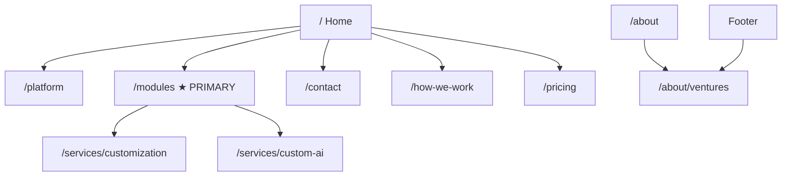

# Axon Enjin — Website Site Map & Information Architecture

**Version:** 2.0 · 8 August 2026 · **Status:** ready to build  
**Owner:** Rhandie Cwebsite contents)  
**Governed by:** [`COMMERCIAL-MODEL-V2.md`]CCOMMERCIAL-MODEL-V2.md) CGTM) · Company Document §2.4 / §8 Ccompliance voice)

> **Read Company Document §2.4 and V2 §8 before writing copy.** Never claim BIR/BSP accreditation. Never say we accept payments. Accounting module = management books + sync — not a CAS replacement.
>
> **Plain language:** write so a **5th–7th grader** can follow. Short words. Short sentences.

---

## 1. The one decision that shapes everything

**The site’s job is to sell the Operating Layer** — one system for every branch — via a **module catalog** and **three offers**. It is **not** built to sell a ₱95,000 Readiness Audit.

| Old site Cv1) | This site Cv2) |
| ----- | ----- |
| Hero → Book a Readiness Audit | Hero → Operating Layer + talk to us / see modules |
| Archetype hub as main event | Module catalog as main product surface |
| 5-rung service ladder | Three offers only |
| Platform rate card hidden; audit priced | Modules listed; **no pesos on site** — prices in quotations only CF-34) |
| Ventures Phase 2 | Ventures live but **secondary** CAbout + footer only) |

**Secondary job:** make the hybrid clear without scaring buyers — ventures improve the tools; they are not the homepage product.

---

## 2. Site map

```
/                                   Home — Operating Layer, three offers, primary CTA
│
├── /platform                       What the Operating Layer is Cshell + modules)
├── /modules                        Add-to-cart catalog CCore + 6 modules)
│
├── /services/
│   ├── /services/customization     Offer 2
│   └── /services/custom-ai         Offer 3 CBuild + 1 year; you own the app)
│
├── /how-we-work                    8 stages + typical times
├── /pricing                        How buying works — no pesos Cquotes only)
│
├── /about/
│   ├── /about                      Team of four + hybrid one-liner
│   └── /about/ventures             Secondary collab + how we select + cash floor
│
├── /contact                        Sales + Collaboration topic
│
└── legal/
    ├── /legal/privacy
    ├── /legal/terms
    └── /legal/data-processing
```



**Not in Phase 1:** `/for/store|appointment|…` archetype hub · readiness-audit · automation-sprint · compliance pack as a product page · engine retainer as a public rung.

---

## 3. Navigation

**Primary nav:** Operating Layer C`/platform`) · Modules · Services · How we work · Pricing · Contact  

**Footer only / About:** Ventures · Team · Legal  

**Do not** put Ventures in primary nav or give it a homepage CTA equal to Modules / Contact.

---

## 4. Page briefs

### `/` — Home

| | |
| ----- | ----- |
| **Job** | State the Operating Layer in one breath; show three offers; CTA to modules or contact |
| **Hero** | *One system for every branch. Add the tools you need.* Sub: *We work like your in-house developers.* |
| **Must include** | Three offers teaser; who it’s for Cmulti-branch, including franchise); CTA **See modules** / **Talk to us** |
| **Must not** | Venture collaboration CTA; Readiness Audit; Growth plan table; pure-equity language |
| **H1 CDOM)** | Plain sentence stating what Axon does Cnot only the wordmark) |

### `/platform`

| | |
| ----- | ----- |
| **Job** | Explain empty shell → buy modules → tabs unlock |
| **Must include** | Centre ↔ branch in plain words; Core; link to `/modules` |

### `/modules`

| | |
| ----- | ----- |
| **Job** | Catalog: Core, HR, Inventory, CRM, Reporting, Accounting Csafe scope), Scheduling |
| **Must include** | Short plain scope per module; Accounting disclaimer Cnot BIR CAS replacement) |
| **Pricing** | Scope + “talk to us” / book a call only — **no pesos** CF-34) |

### `/services/customization` — Offer 2

| | |
| ----- | ----- |
| **Job** | Same system, tailored to their needs |
| **CTA** | Contact / discovery |

### `/services/custom-ai` — Offer 3

| | |
| ----- | ----- |
| **Job** | Custom AI / custom software; Build + 12 months care by default; extend or remove |
| **Must include** | You own the app; we keep shared libraries; typical ~4 months to live |
| **CTA** | Contact |

### `/how-we-work`

| | |
| ----- | ----- |
| **Job** | 8 stages Inquiry→Go-live C+ Maintain); typical times per offer |
| **Tone** | Plain; not a public SLA until published as such |

### `/pricing`

| | |
| ----- | ----- |
| **Job** | How buying works: Core + modules; Offer 2 scoped; Offer 3 Build + care — **no currency amounts** |
| **Must not** | Any ₱ / $ list prices CF-34). Old Growth/audit numbers. |

### `/about`

| | |
| ----- | ----- |
| **Job** | Four named people; hybrid one-liner; link to ventures |
| **Team** | Jerico CCEO), Aidan CCTO), Gerald CDeputy Eng), Rhandie CDeputy Eng) |

### `/about/ventures`

| | |
| ----- | ----- |
| **Job** | Secondary path for startup collaboration |
| **Must include** | How we select; cash floor + optional equity; no pure-equity CTA; tooling-gets-better framing; capacity is small |
| **CTA** | Collaboration inquiry Cform topic or dedicated) |

### `/contact`

| | |
| ----- | ----- |
| **Job** | Operating Layer sales + optional topic **Collaboration** |
| **Fields** | Name, company, branches Coptional), offer interest, message |

### Legal

Privacy, terms, data-processing — Company Document §8.4 PIP posture still applies.

---

## 5. Conversion architecture

**Primary conversion:** Contact or module interest COperating Layer Offers 1–2).  
**Secondary:** Custom AI inquiry COffer 3).  
**Tertiary:** Collaboration inquiry from `/about/ventures` only.

Forms may still qualify Cbranch count, offer type). Do **not** hard-block single-location Offer 3 or collaboration topics.

---

## 6. Copy rules Csite-wide)

1. Grade **5–7** reading level where possible.  
2. Prefer “one system for every branch” over jargon.  
3. Product name: **Operating Layer** — not “Franchise Operating Layer” as the title.  
4. Franchise = strong fit, not the only buyer word.  
5. §2.4 compliance and payment rules are legal constraints.  
6. No pure-equity or “build for free” language anywhere public.

---

## 7. Publication blockers

| Blocker | Action |
| ----- | ----- |
| No public pesos CF-34) | Site never shows ₱; numbers only in quotes |
| Live FX on quotes CF-35) | Dynamic converter; stamp rate + date on every quote |
| No Google Calendar URL yet | Wire when founders share booking link CV2 A2) |
| Accounting scope | Safe wording only CV2 §4) |
| Case studies | Not required for Phase 1; team + plain process are the proof |
| Single-page today | `index.html` may stay one page until multi-route build; **content must match V2** even on one scroll |

---

## 8. Single-page interim map

Until routes exist, map sections on `index.html` to:

| Section | Maps to |
| ----- | ----- |
| Hero | `/` |
| How it works | `/platform` + `/how-we-work` |
| Modules / offers | `/modules` + three offers |
| Custom AI | `/services/custom-ai` |
| Team / about | `/about` |
| Ventures Cshort, low) | `/about/ventures` — footer-adjacent, not hero |
| Contact | `/contact` |

---

*Supersedes SITEMAP v1.0 C3 Aug 2026) audit-first IA.*


