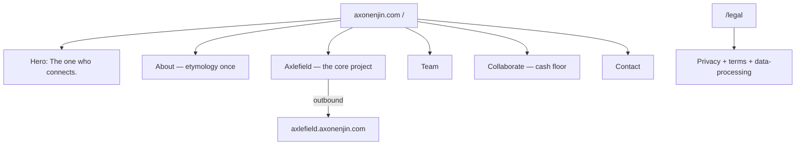
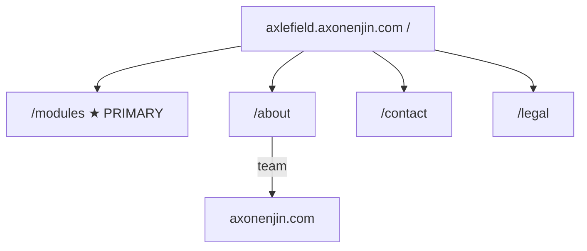

# Axon Enjin — Website Site Map & Information Architecture

**Version:** 3.0 · 15 August 2026 · **Status:** ready to build
**Owner:** Rhandie (website contents)
**Governed by:** [`COMMERCIAL-MODEL-V2.md`](COMMERCIAL-MODEL-V2.md) (GTM) · Company Document §2.4 / §8 (compliance voice)

> **Read Company Document §2.4 and V2 §8 before writing copy.** Never claim BIR/BSP accreditation. Never say we accept payments. Accounting module = management books + sync — not a CAS replacement.
>
> **Plain language:** write so a **5th–7th grader** can follow. Short words. Short sentences.

This document **supersedes SITEMAP v2.0** (one-site tree). Public presence is two properties: company and product.

---

## 1. The one decision that shapes everything

**Two hosts. Two jobs.**

| Property | Host | Job |
| ----- | ----- | ----- |
| **A — Axon Enjin** | `https://axonenjin.com` | Company presence |
| **B — Axlefield** | `https://axlefield.axonenjin.com` | Sell the product |

The company site is not a module catalog. The product site is not a ventures page. Axlefield HTML lives in its own repo and is **not** built in the company-site batch.

**Interim (until the Axlefield repo exists):** product story, offers, and how-it-works copy may remain as **sections on the company homepage**. Company primary nav already points **Axlefield** at `https://axlefield.axonenjin.com/`. When the product site ships, those sections leave the company homepage (or shrink to a short outbound teaser). Do not invent a third IA while both live on one scroll.

---

## 2. Site map

### Property A — Axon Enjin (company)

```
https://axonenjin.com
│
├── /                 Single scroll — company presence
│                       hero · about · Axlefield (the core project) · team
│                       collaborate · contact
│
└── /legal            One page: privacy + terms + data-processing
                      (not built this batch)
```



### Property B — Axlefield (product)

```
https://axlefield.axonenjin.com
│
├── /                 Product story · three offers · how it works · how buying works
│                       (no currency amounts; no /pricing route)
├── /modules          Core + 6 modules
├── /about            Axlefield as an Axon Enjin product; team → company site
├── /contact          Sales only (no Collaboration topic)
└── /legal            One combined legal page
```



**Never on the product site:** ventures, `/platform`, `/services/*`, `/how-we-work`, `/pricing`, archetype `/for/*`, currency amounts.

---

## 3. Navigation

### Company — `axonenjin.com`

**Primary nav (3):** About · Axlefield · Contact

- About → company `/` about section (or in-page `#about`)
- Axlefield → `https://axlefield.axonenjin.com/` (outbound; already wired)
- Contact → company contact section / `#contact`

**Footer:** Collaborate · Team · Legal · optional founder link (`https://delatorre.axonenjin.com`)

**Do not** put Ventures, Collaborate, or a fake project grid in primary nav. Collaborate is footer / collaborate section only.

### Product — `axlefield.axonenjin.com`

**Primary nav (3):** Modules · About · Contact

**Footer:** Legal · Axon Enjin (`https://axonenjin.com`)

**Never** include Ventures or Collaborate on the product nav or footer.

---

## 4. Page briefs

### Property A — company

#### `/` — Home (single scroll)

| | |
| ----- | ----- |
| **Job** | Company presence. Name who we are. Point to Axlefield as **the** core project. |
| **H1 (DOM)** | *The one who connects.* (D-2026-008) — company tagline, not only the wordmark |
| **Sections (in order)** | Hero · about (etymology once) · Axlefield as the core project (outbound to subdomain) · team · collaborate · contact |
| **Hero** | *The one who connects.* Do not use Operating Layer or FOL as a public title. Do not use “Agentic AI Systems” as H1. No Greek script or neuron art. |
| **About** | Teach the name once: Axon = axis / cable that carries signal. Enjin = engine / the one who connects. We connect people through systems. |
| **Axlefield block** | **Axlefield** (D-2026-009) — *An Axon Enjin product.* Outbound to `https://axlefield.axonenjin.com/`. This is the core project — not a card in a grid of named side projects. |
| **Team** | Four named people: Jerico (CEO), Aidan (CTO), Gerald (Deputy Eng), Rhandie (Deputy Eng) |
| **Collaborate** | Secondary. Cash floor; equity optional and rare; **no pure-equity CTA**. Do not name unvalidated ventures. Capacity is small. Tooling-gets-better framing is allowed. |
| **Contact** | Talk to us. Company form may still qualify interest. Collaboration is not a homepage-equal CTA. |
| **Must not** | Currency amounts; Readiness Audit as the front door; fake project grid; named unvalidated ventures; Ventures in the hero |

#### `/legal` — combined legal (not built this batch)

| | |
| ----- | ----- |
| **Job** | One page: privacy + terms + data-processing |
| **Note** | Company Document §8.4 PIP posture still applies. Do not ship three separate legal routes in Phase 1. |

### Property B — product (docs only this batch; HTML in Axlefield repo)

#### `/` — Product home

| | |
| ----- | ----- |
| **Job** | Sell Axlefield. Product story, three offers, how it works, how buying works. |
| **Product name** | **Axlefield** — *An Axon Enjin product.* |
| **Must include** | Three offers; who it is for (multi-branch, including franchise as a use case); how buying works **without a `/pricing` route and without currency amounts** (F-34) |
| **CTA** | **See modules** / **Talk to us** |
| **Must not** | Collaboration topic; Ventures; Operating Layer / FOL as a public title; currency amounts |

#### `/modules`

| | |
| ----- | ----- |
| **Job** | Catalog: Core, HR, Inventory, CRM, Reporting, Accounting (safe scope), Scheduling |
| **Must include** | Short plain scope per module; Accounting disclaimer (not a BIR CAS replacement) |
| **Pricing** | Scope + “talk to us” only — **no currency amounts** (F-34) |

#### `/about`

| | |
| ----- | ----- |
| **Job** | Axlefield as an Axon Enjin product |
| **Team** | Point to the company site (`https://axonenjin.com`) — do not duplicate a ventures story here |

#### `/contact`

| | |
| ----- | ----- |
| **Job** | Sales |
| **Fields** | Name, company, branches (optional), offer interest, message |
| **Must not** | Collaboration topic |

#### `/legal`

| | |
| ----- | ----- |
| **Job** | One combined legal page (privacy + terms + data-processing) |

---

## 5. Conversion architecture

**Company (`axonenjin.com`)**

- **Primary:** outbound to Axlefield (`https://axlefield.axonenjin.com/`) and **Talk to us**.
- **Tertiary:** collaborate — from company footer / collaborate section only. Not in primary nav. Not equal to Axlefield / Contact.

**Product (`axlefield.axonenjin.com`)**

- **Primary:** **See modules** / **Talk to us**.
- **No** collaboration topic. No ventures CTA.

Forms may still qualify (branch count, offer type). Do **not** hard-block single-location Offer 3 on the product contact form.

---

## 6. Copy rules (site-wide)

1. Grade **5–7** reading level where possible.
2. Company H1: **The one who connects.** (D-2026-008)
3. Public product word: **Axlefield** (D-2026-009) — *An Axon Enjin product.* Do not call the product Axon Enjin.
4. Do **not** use “Operating Layer,” “Franchise Operating Layer,” or “FOL” as a public title. Those names are internal/historical only.
5. Franchise = strong fit, not the only buyer word and not the homepage title.
6. §2.4 compliance and payment rules are legal constraints.
7. No pure-equity or “build for free” language anywhere public.
8. No “Agentic AI Systems,” Greek script, or neuron art in the hero.
9. **F-34:** no currency amounts on either public property. Prices live in quotations only.
10. Do not name unvalidated ventures on either property.

---

## 7. Phase-1 exclusions

**Company — not Phase 1**

- Investments
- Highlights
- Join our team
- Fake project grid
- Named unvalidated ventures
- Separate `/legal/privacy`, `/legal/terms`, `/legal/data-processing` routes (use one `/legal` page when built)

**Product — never**

- Ventures / collaborate
- `/platform`
- `/services/*`
- `/how-we-work`
- `/pricing`
- Archetype `/for/*`
- Currency amounts

**Both — still out**

- Readiness Audit as the public front door
- Automation sprint / compliance pack as a product page
- Engine retainer as a public rung
- Archetype hub (`/for/store`, `/for/appointment`, …)

---

## 8. Publication blockers

| Blocker | Action |
| ----- | ----- |
| No public currency amounts (F-34) | Neither property shows list prices; numbers only in quotes |
| Live FX on quotes (F-35) | Dynamic converter; stamp rate + date on every quote |
| No Google Calendar URL yet | Wire when founders share booking link (V2 A2) |
| Accounting scope | Safe wording only (V2 §4) |
| Case studies | Not required for Phase 1; team + plain process are the proof |
| `/legal` on company | Not built this batch |
| Axlefield HTML | Waits for its own repo; company nav already points at the subdomain |

---

## 9. Single-page interim maps

### Company — until `/legal` (and any in-page anchors) are split

Until extra company routes exist, map sections on `axonenjin.com` `index.html` to:

| Section | Maps to |
| ----- | ----- |
| Hero | Company `/` |
| About (etymology once) | Company about |
| Axlefield (core project) | Outbound `https://axlefield.axonenjin.com/` |
| Team | Footer Team |
| Collaborate (short, low) | Footer Collaborate — not hero, not primary nav |
| Contact | Company Contact |

**Product-on-company interim:** until the Axlefield repo exists, product sections (story, three offers, how it works, how buying works, modules teaser) **may remain on the company homepage**. Nav **Axlefield** still goes to `https://axlefield.axonenjin.com/`. That is expected, not a third sitemap.

### Product — until Axlefield routes exist

When the product site is still one scroll in its own repo, map sections to:

| Section | Maps to |
| ----- | ----- |
| Product story + three offers + how it works + how buying works | Product `/` |
| Modules | `/modules` |
| About (product of Axon Enjin) | `/about` |
| Contact (sales) | `/contact` |
| Legal | `/legal` |

Do not park a collaborate section on the product interim page.

---

*Supersedes SITEMAP v2.0 (8 Aug 2026) one-site tree, and SITEMAP v1.0 (3 Aug 2026) audit-first IA.*
